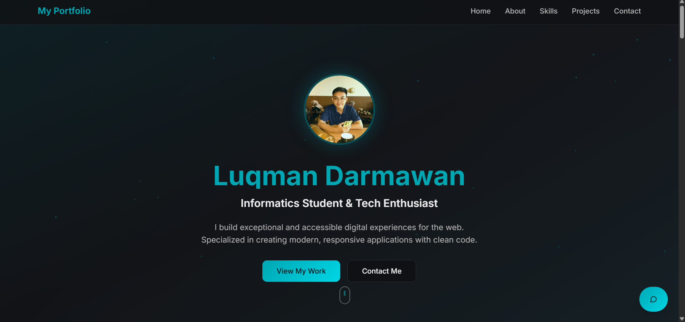
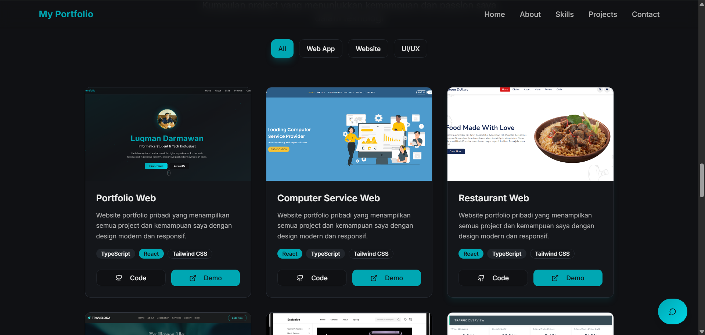

# 🌐 My Portfolio Website

Welcome to the repository of my personal developer portfolio.
This project showcases my background, skills, projects, and ways to get in touch with me.

# 🚀 Tech Stack

This portfolio is built using modern web technologies:

- ⚡ Vite – Lightning-fast development build tool

- ⚛️ React + TypeScript – For a scalable and maintainable front-end

- 🎨 Tailwind CSS – Utility-first CSS framework for responsive design

- 🧩 shadcn/ui – Prebuilt UI components for a clean and modern look

# 📂 Project Setup

Clone the repository and install dependencies to start working locally:

Clone this repository
  
- git clone <YOUR_REPO_URL>

Move into project directory
  
- cd <YOUR_PROJECT_NAME>

Install dependencies
  
- npm install

Start development server
  
- npm run dev

Your app will be running at: http://localhost:8080/
 (default Vite port).

# 📌 Features

- 🤖 AI Chatbot - A Chatbot using your OpenAi API
  
- 💼 About Me – A section introducing who I am and what I do

- 🛠️ Tech Stack – The tools, frameworks, and languages I use

- 📂 Projects – Highlighted works with links to repositories or live demos

- ✉️ Contact – Quick ways to connect (Email, LinkedIn, GitHub) and send Email using EmailJS

- 📍 Location – Integrated map section for easy reference

# 🌍 Deployment

This portfolio can be deployed easily to any modern hosting platform:

- Vercel

- Netlify

- GitHub Pages

Build the project before deploying:

- npm run build

Output will be available in the dist/ directory.

# 📫 Contact
If you'd like to reach out, feel free to connect with me:

- 📧 Email: luqmanfn17@gmail.com

- 💼 LinkedIn: https://www.linkedin.com/in/luqman-aprianto-darmawan

- 🐙 GitHub: https://github.com/LuqmanApriantoDarmawan

✨ Crafted with passion & continuous learning.

## Preview

### Home Section

### Skills Section

### Projects Section

